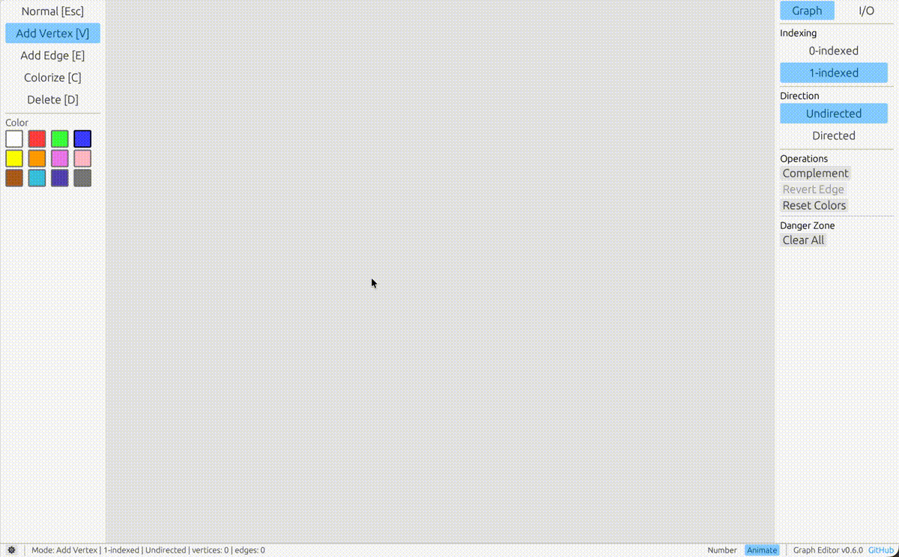

# Graph Editor

[](https://github.com/kentakom1213/graph-editor/actions?workflow=CI)

Graph Editor は，競技プログラミング用のグラフを直感的に作成・編集できるアプリです．

頂点や辺をマウスで編集し，辺リスト形式でコピーしたり，PNG / SVG 画像として出力したりできます．



## 使い方

画面は大きく次の 4 つに分かれています．

| 場所           | できること                         |
| :------------- | :--------------------------------- |
| 左ツールバー   | 編集モードと色を選ぶ               |
| 中央キャンバス | グラフを編集する                   |
| 右パネル       | グラフ設定，入出力，画像出力を行う |
| 下部バー       | 現在の状態を確認する               |

## 基本操作

### 頂点を追加する

左ツールバーで `Add Vertex` を選び，キャンバス上をクリックします．

ショートカットは `V` です．

### 辺を追加する

左ツールバーで `Add Edge` を選び，2 つの頂点を順にクリックします．

ショートカットは `E` です．

### 頂点を移動する

左ツールバーで `Normal` を選び，頂点をドラッグします．

ショートカットは `N` または `Esc` です．

### 頂点や辺を削除する

左ツールバーで `Delete` を選び，削除したい頂点または辺をクリックします．

ショートカットは `D` です．

### 頂点や辺の色を変える

左ツールバーで色を選び，色を変えたい頂点または辺をクリックします．

ショートカットは `C` です．

## グラフ設定

右パネルの `Graph` から，グラフ全体の設定を変更できます．

| 操作                      | 内容                                |
| :------------------------ | :---------------------------------- |
| `0-indexed` / `1-indexed` | 頂点番号の表示を切り替える          |
| `Undirected` / `Directed` | 無向グラフ / 有向グラフを切り替える |
| `Complement`              | 補グラフを作成する                  |
| `Revert Edge`             | 有向辺の向きをすべて反転する        |
| `Reset Colors`            | 頂点と辺の色を初期状態に戻す        |
| `Clear All`               | グラフをすべて削除する              |

`Complement` は無向グラフのときのみ使用できます．

`Revert Edge` は有向グラフのときのみ使用できます．

## 入出力

右パネルの `I/O` から，グラフの入出力と画像出力を行えます．

| 操作           | 内容                                        |
| :------------- | :------------------------------------------ |
| `Edge List`    | 辺リスト形式でコピー・読み込みする          |
| `JSON`         | Graph Editor 用の JSON 形式で保存・復元する |
| `Export Image` | PNG / SVG 形式で画像を出力する              |

`Edge List` は，競技プログラミングで使いやすい形式です．

`JSON` は，頂点位置や色情報も含めて保存したいときに使います．

## ショートカット

|    キー     | 操作                               |
| :---------: | :--------------------------------- |
| `N` / `Esc` | Normal                             |
|     `V`     | Add Vertex                         |
|     `E`     | Add Edge                           |
|     `C`     | Colorize                           |
|     `D`     | Delete                             |
|     `1`     | 0-indexed / 1-indexed を切り替える |
| `Shift + D` | Undirected / Directed を切り替える |
|     `A`     | アニメーションを切り替える         |
|     `[`     | グラフ全体を左回転する             |
|     `]`     | グラフ全体を右回転する             |

## キャンバス操作

| 操作       | 内容                        |
| :--------- | :-------------------------- |
| ドラッグ   | グラフ全体を平行移動する    |
| スクロール | グラフ全体を拡大 / 縮小する |

## ローカルで実行する

```bash
git clone https://github.com/kentakom1213/graph-editor.git
cd graph-editor
cargo run --release
```

## Web 版をローカルで確認する

Rust と Trunk が必要です．

```bash
rustup target add wasm32-unknown-unknown
cargo install --locked trunk
trunk serve
```

ブラウザで `http://127.0.0.1:8080` を開いて確認してください．

## 開発用コマンド

```bash
cargo fmt
cargo check
cargo test
```

## コントリビューション

バグ報告，機能追加の提案，プルリクエストなど歓迎いたします．

## ライセンス

このプロジェクトは MIT ライセンス，Apache License 2.0 のデュアルライセンスで提供されています．

詳細は [LICENSE-MIT](https://github.com/kentakom1213/graph-editor/blob/main/LICENSE-MIT) および [LICENSE-APACHE](https://github.com/kentakom1213/graph-editor/blob/main/LICENSE-APACHE) を参照してください．
